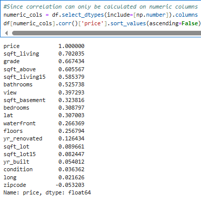
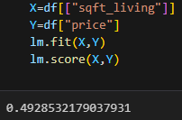
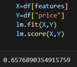
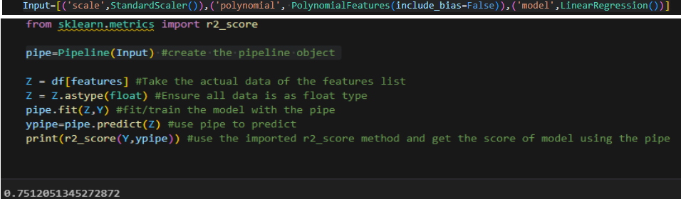
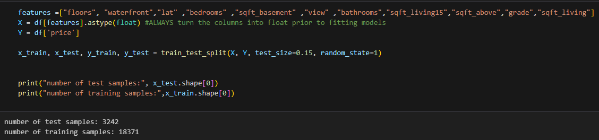
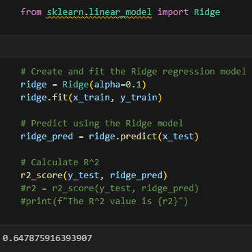
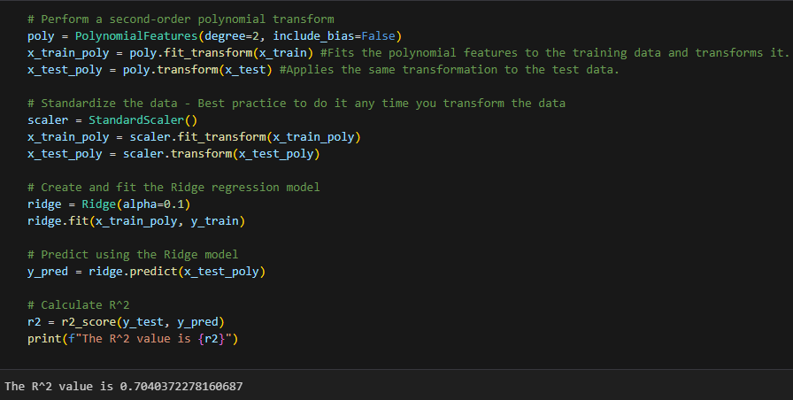
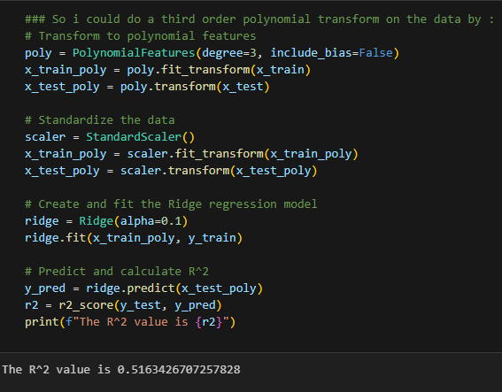

# King County Housing Price Prediction
This project analyzes housing data from King County to build models for predicting home sale prices. The goal is to aid in real estate investment decisions. 

## Objective
As a data analyst at a real estate investment trust, I was tasked with determining factors that influence housing prices and developing predictive models. This will help assess markets and value of potential properties to purchase.

## Installation
Install the required Python libraries with:

```bash
pip install pandas numpy matplotlib seaborn scikit-learn
```

## The Data
The dataset contains over 21,000 home sale records for King County, WA between 2014-2015. Features include property details like bedrooms, bathrooms, square footage, building age, as well as location and sale date/price.

| Variable      | Description                                                                                                 |
| ------------- | ----------------------------------------------------------------------------------------------------------- |
| id            | A notation for a house                                                                                      |
| date          | Date house was sold                                                                                         |
| price         | Price is prediction target                                                                                  |
| bedrooms      | Number of bedrooms                                                                                          |
| bathrooms     | Number of bathrooms                                                                                         |
| sqft_living   | Square footage of the home                                                                                  |
| sqft_lot      | Square footage of the lot                                                                                   |
| floors        | Total floors (levels) in house                                                                              |
| waterfront    | House which has a view to a waterfront                                                                      |
| view          | Has been viewed                                                                                             |
| condition     | How good the condition is overall                                                                           |
| grade         | overall grade given to the housing unit, based on King County grading system                                |
| sqft_above    | Square footage of house apart from basement                                                                 |
| sqft_basement | Square footage of the basement                                                                              |
| yr_built      | Built Year                                                                                                  |
| yr_renovated  | Year when house was renovated                                                                               |
| zipcode       | Zip code                                                                                                    |
| lat           | Latitude coordinate                                                                                         |
| long          | Longitude coordinate                                                                                        |
| sqft_living15 | Living room area in 2015(implies-- some renovations) This might or might not have affected the lotsize area |
| sqft_lot15    | LotSize area in 2015(implies-- some renovations)       

## Methodology
Data preprocessing involved removing outliers, converting date values, and engineering new features like age of the home. Exploratory analysis identified strong correlations, especially between square footage and price. Models such as Linear Regression and Decision Tree Regressor were trained and evaluated. Metrics like R² and RMSE were used to assess performance.

## Results
### Living space (sqft_living) had the strongest correlation with price.



### I trained a linear regression model based on square feet to predict price
You can see the r2 score is not very accurate at .49



### So a linear regression model was trained using all the other features to predict price
You can see that this model is much more accurate with an r2 score of .65



### Then I made a pipeline to automate the process of preparing for machine learning
The scaler standardizes features by removing the mean and scaling to unit variance. So instead of having numbers like [999,1000,1010], now you would have [.99, 1, 1.1]. It makes the processing easier for the system to handle and scale to large datasets.

Polynomial features generates new features that are combinations of the original features raised to a power. This allows the model to capture non-linear relationships.

The Linear Regression to predict the price using the list of all other features. This could be switched with other sklearn estimators such as
- Decision Trees: DecisionTreeRegressor or DecisionTreeClassifier
- Random Forests: RandomForestRegressor or RandomForestClassifier
- Support Vector Machines: SVR or SVC
- Gradient Boosting: GradientBoostingRegressor or GradientBoostingClassifier
- Neural Networks: MLPRegressor or MLPClassifier

  


### Now the dataset was split into training and testing data. 



### This time, a Ridge regression object was created and fit using the training data. 
I set the regularization parameter to 0.1 and calculated the R^2 using the test data. The r2 score is higher at .64. 
The regularization parameter, alpha=0.1, means that the model will apply a moderate penalty to the coefficients, helping to balance fitting the training data while avoiding overfitting.

When alpha is 0: The model behaves like standard linear regression without any regularization.

When alpha is greater than 0: The model penalizes large coefficients. This means it will shrink the coefficients toward zero, which can help reduce overfitting by simplifying the model.



### Lastly, I performed a second order polynomial transform on both the training data and testing data, created and fit a Ridge regression object using the training data, set the regularisation parameter to 0.1, and calculated the r2 utilising the test data.
This model has proven to be the most accurate with an accuracy score of .70



### I ran the same code, but used a third order polynomial transform, but this resulted in a lower r2 score of .51



## Future Work
Test advanced models like Gradient Boosting or XGBoost.

Incorporate external features like school district or crime rates.

Deploy as a web app to assist home buyers and agents.


